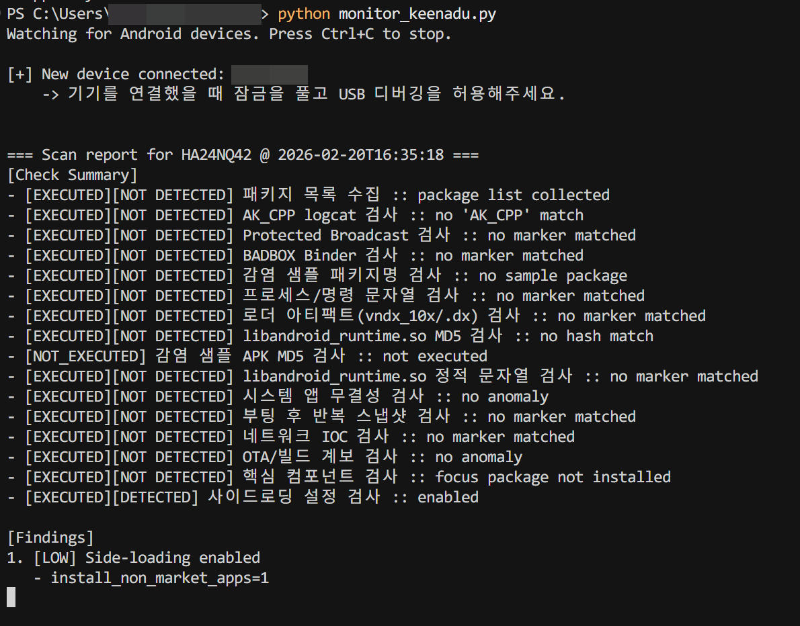
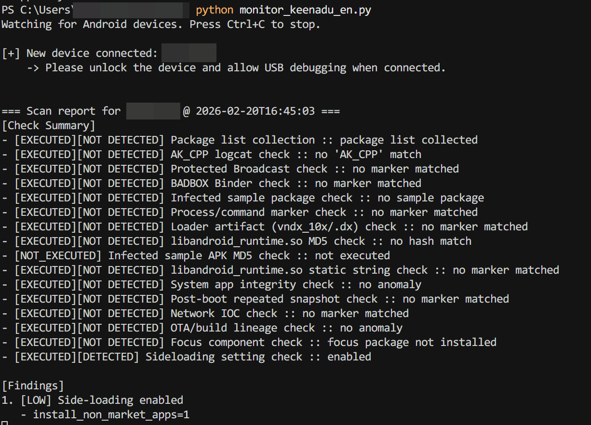

# Android Keenadu Auto Scanner

Korean version: `README.ko.md`

This project automatically scans connected Android tablets (via ADB) for Keenadu IOC indicators.

## Requirements
- Windows
- Python 3.10+
- `adb` available in PATH

## Scripts
- Korean script: `monitor_keenadu_ko.py`
- English script: `monitor_keenadu_en.py`

## Run
```powershell
python monitor_keenadu_en.py
```

Recommended (reboot-based AK_CPP check):
```powershell
python monitor_keenadu_en.py --reboot-for-logcat --logcat-seconds 30
```

Verbose + full command logs:
```powershell
python monitor_keenadu_en.py --verbose --command-log-file logs\keenadu_cmdlog.json
```

## Check Status Meaning
- `[EXECUTED][DETECTED]`: check ran and marker found
- `[EXECUTED][NOT DETECTED]`: check ran and marker not found
- `[NOT_EXECUTED]`: check could not run due to access/permission/command failure

## Notes
- IOC-based detection can have false negatives/false positives.
- Negative results do not guarantee full safety.
- Update `keenadu_iocs.json` when newer IOC data is published.

## Sample Output

### KR Sample


### EU Sample

